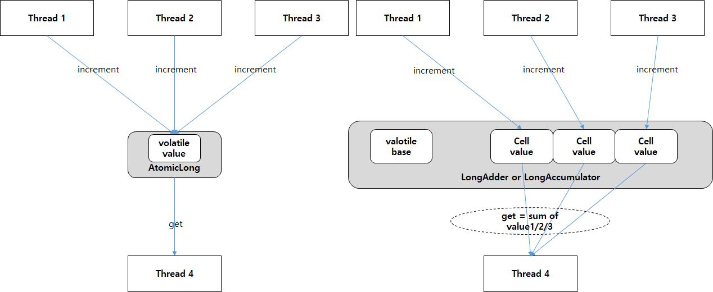
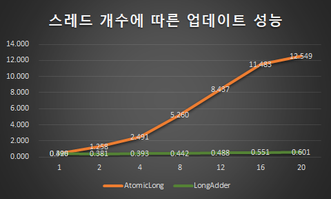
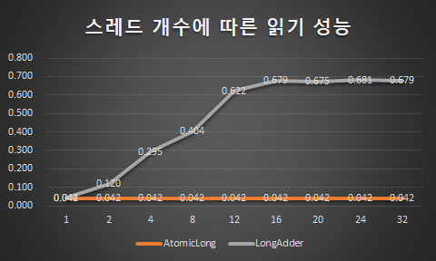

## LongAdder와 LongAccumulator

이전 포스팅에서는 Atomic Type에 대하여 알아보았다. -> [Atomic Type에 대하여](https://hojoon7807.github.io/atomic/)

Atomic 클래스는 원자성을 보장하고 CAS 알고리즘으로 구현되어있다. 쓰레드 간의 경쟁(Race condition)이 심한 경우 CPU 소모가 크겠지만 Lock을 사용하는 것 보단 성능적 측면에서 우위에 있을 것이다.

LongAdder와 LongAccumulator은 AtomicLong에서 사용하는 CAS 연산에 의한 경합 과정에서 CPU 소모를 줄이기 위해 고안되었다.



AtomicLong일 경우 위의 그림에서 볼 수 있듯이, 단일 volatile 변수를 공유하기 때문에, CAS를 사용한 반복적인 메모리 읽기 작업과 비교 연산 수행 과정에서 CPU를 많이 소모하게 되고 경합과정이 일어나게 된다.

하지만 LongAdder와 LongAccumulator는 이 문제점을 해결하기 위해 공용 메모리인 **base**와 쓰레드 별 메모리인 **cell**로 나누어 설계되어있다. base 변수를 CAS 방식으로 읽다가 업데이트가 실패하면 while문을 도는 것 대신 쓰레드 별로 cell 메모리에 별도의 연산을 수행한다.

이러한 개념을 **Dynamic Striping**이라고 하며 이를 구현한 Striped64 클래스를 LongAdder와 LongAccumulator가 상속받는다.

## CPU Cache의 False sharing 최소화

ongAdder와 LongAccumulator는 cell이라고 하는 여러 개의 개별 변수를 갖고 있는데, 이 변수들은 일반적으로 메모리상에 근접해 있다. 이러한 데이터들은 CPU Cache상에 존재할 가능성이 높고 CPU에서는 캐시 일관성(cache coherence)이라는 메커니즘이 존재한다. 만약 한 쓰레드가 자신의 cell value를 변경할 경우 일관성을 유지하기 위해 다른 쓰레드의 CPU Cache도 계속 업데이트 해야하는 false sharing이 발생할 가능성이 높다.

false sharing을 더 자세히 설명하면 다음과 같다.

> False Sharing은 보통 cache coherency protocol에 의해 발생한다. cache는 보통 word 단위가 아닌 block 단위로 데이터를 가져오는데 이것을 cache line이라고 한다.\
>  cache line은 보통 64바이트, 128바이트 단위로 모든 작업이 이루어진다. 만약 thread 0에서 사용하는 데이터는 block의 첫 번째 4바이트 뿐이고, thread 1에서도 사용하는 데이터는 마지막 4바이트라고 가정하면 이 둘은 실제 공유하는 데이터가 없지만 같은 cache line에 있기 때문에 어느 한 코어가 데이터에 접근할 때 마다 CPU는 cache가 공유되는 것으로 착각한다.\
> 그래서 서로를 invalid 시키는 현상이 일어나게 되고, cache miss를 겪게 된다. 따라서 false sharing은 성능 하락으로 이어질 수 있다.

그래서 이를 해결하기 위해 Striped64 클래스는 cell의 value가 Cache line의 크기가 되도록 padding을 붙이게 된다.

```java
@jdk.internal.vm.annotation.Contended static final class Cell {
```

Striped64 클래스의 내부클래스 Cell에 있는 Contended 어노테이션이 padding을 추가하는 역할을 한다.

## 차이점

Oracle Java 17 API 문서에서는 각 클래스를 다음과 같이 설명하고 있다.

### LongAdder

LongAdder클래스는 일반적으로 세분화된 동기화 제어가 아닌 통계 수집과 같은 일반적인 합계를 업데이트할 때 AtomicLong보다 선호된다. 낮은 경합에서는 두 클래스가 비슷한 특성을 가지지만 더 많은 경합에서 예상 처리량은 훨씬 높다.\
이 클래스는 Number 클래스를 상속 받았고, 객체가 계속 변할 것이라 예상해 equals, hashcode, compareTo 메서드를 정의하지 않았다. 그래서 컬렉션의 key로 유용하지 않다.

### LongAccumulator

스레드 내 또는 스레드 간의 누적 순서는 보장되지 않으며 의존할 수 없으므로 LongAccumulator 클래스는 누적 순서가 중요하지 않은 함수에만 적용할 수 있다. 제공된 accumulator function은 스레드 간의 경합으로 인해 업데이트 시도가 실패할 때 다시 적용될 수 있으므로 부작용이 없어야 한다. 함수는 기존 값을 하나의 인자로 적용하고 주어진 업데이트를 다른 인자로 적용한다. 예를 들어 최대값을 유지하려면 Long.MIN_VALUE와 함께 Long::max를 함수에 제공 함으로 구현할 수 있다.

마찬가지로 Number 클래스를 상속 받았고, 객체가 계속 변할 것이라 예상해 equals, hashcode, compareTo 메서드를 정의하지 않았다. 그래서 컬렉션의 key로 유용하지 않다.

`new LongAdder()`는 `new LongAccumulator((x, y) -> x + y, 0L)`과 같다고 할 수 있다.

```java
LongAccumulator acc = new LongAccumulator(Long::sum, 0);

acc.accumulate(10);
```

accumulate(10) 메소드를 호출하면 a[0]에 인자로 받은 10과 생성자의 두번째 인자로 받은 초기값 0이 합쳐져 10+0의 결과가 a[0]에 들어가고,\
계속 accumulate 메소드를 호출할수록 a[n]번째에 이처럼 인자+초기값의 결과가 누적된다.

## AtomicLong과 LongAdder 성능 차이

### 업데이트 성능

<P align="center">

</p>

AtomicLong의 경우 쓰레드의 개수 증가할수록 성능 하락이 큰폭으로 증가한다. 반면 LongAdder는 쓰레드 개수와 비교해 실행 시간이 증가하지만 총 실행시간 자체가 상대적으로 매우 짧다.

### 읽기 성능

<P align="center">

</p>

AtomicLong은 내부에 단일 멤버 변수 하나를 사용하기 쓰레드 개수에 상관없이 읽기 시간이 비등하지만, LongAdder의 경우 쓰레드가 늘어날수록 읽을 때 합산해야하는 값의 개수가 증가하므로 실행시간이 증가한다.

경우에 따라 읽기 작업을 많이 수행하는 상황이면 Atomic 클래스를 사용하고, 쓰기 작업을 많이 수행하는 상황이면 adder나 accumulator를 사용하면될 것 같다.
