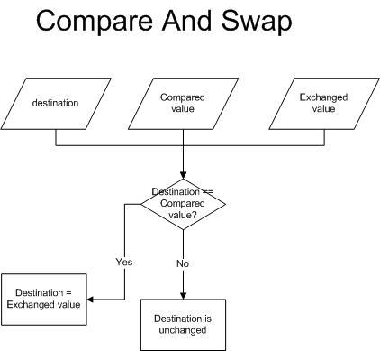
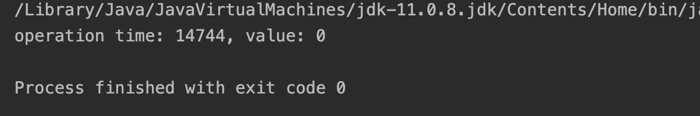
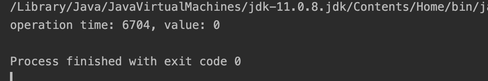

## Atomic

자바의 concurrency API에서 제공하는 Atomic Type에 대해 알아보겠다.\
멀티 쓰레딩 프로그래밍에서는 기본적으로 동시성 문제를 고려해야되는데, 이러한 문제들을 해결하기 위해 자바에서는 다양한 방법을 제공한다.\
대표적으로 Atomic Type, volatile, synchronized가 있다.

Atomic Type을 설명하기전에 원자성의 개념을 알아보자.

Atomic은 한글로 원자라는 의미를 가지고 있고, 원자는 더 쪼갤 수 없는 작은 단위를 의미한다.
Oracle 자바 레퍼선스에서는 Atomic Access를 다음과 같이 정의하고 있다.

> In programming, an atomic action is one that effectively happens all at once.\
> An atomic action cannot stop in the middle: it either happens completely, or it doesn't happen at all.

원자적 행위란 사실상 여러가지가 한번에 일어나는 것을 말하는데, 이는 중간에 중지될 수 없고 실행되면 끝까지 실행되던가 아니면 아예 실행되지 않아야 한다고 말한다. 예시를 들어 설명하면 쇼핑몰에서 물건을 주문하는 경우를 말할 수 있다.

결제와 상품 수량 변경은 서로 다른 작업이지만 한 세트로 진행이 되어야 한다. 어떤 상품의 재고가 1개 밖에 없는데 해당 상품을 사려는 고객이 2명이 존재하는 상황을 가정하고 아래와 같은 순서로 요청이 들어오면 어떻게 되는지 살펴보자.

1. 1번 회원의 결제가 성공한다.
2. 상품 수량의 업데이트가 끝나기전에 2번 회원의 결제도 성공한다.
3. 상품 수량 업데이트
4. 상품 수량 업데이트 - 3번의 작업으로 재고는 이미 0이 되었지만 2번 회원은 이미 돈을 지불했는데 재고가 0인 상태다.

현실에서는 이와 같이 많은 사람들이 동시에 동일한 제품을 구매하려는 상황이 부지기수다.\
작업이 정상적으로 처리되려면 1번 회원의 결제 결과가 재고에 반영되기 전에 2번 회원의 결제를 잠시 막아둬야하고, 다시 2번 회원의 결제가 시작될 때 재고를 확인하고 재고가 0이라면 결제를 막아야 한다. 비슷한 예시로 수강신청이 있다.

하나의 쓰레드가 모든 작업을 순차적으로 처리하면 이러한 걱정이 없겠지만 사용자는 많은 대기시간을 가지게될 것이다. 그래서 멀티 쓰레드가 사용된다.\
이처럼 작업 단위가 분리되면 안되는 연산에 Atomic operation이 필요하고 Java에서 지원해주는 Atomic operation이 Atomic Type, volatile, synchronized 이다.

## Atomic Type

**Atomic Type**을 사용하면 멀티 쓰레드 환경에서 원자성을 보장하는 변수를 선언할 수 있다.\
Atomic Type은 내부적으로 CAS(Compare and swap)알고리즘을 통해서 lock 없이 동기화 처리를 한다.

### CAS(Compare and swap)

<p align="center">

</p>

현재 쓰레드에서의 데이터와 실제 메모리에 저장된 데이터를 비교해서 두 개가 일치하면 데이터를 업데이트하고 일치하지 않는다면 재시도를 하게된다.

Atomic 내부에서는 다음과 같이 구현되어있다.

```java
public class AtomicInteger extends Number implements java.io.Serializable {

    private static final jdk.internal.misc.Unsafe U = jdk.internal.misc.Unsafe.getUnsafe();
    private static final long VALUE = U.objectFieldOffset(AtomicInteger.class, "value");
    private volatile int value;

    public final int getAndSet(int newValue) {
        return U.getAndSetInt(this, VALUE, newValue);
    }
}

public final class Unsafe {
    @HotSpotIntrinsicCandidate
    public final int getAndSetInt(Object o, long offset, int newValue) {
        int v;
        do {
            v = getIntVolatile(o, offset);
        } while (!weakCompareAndSetInt(o, offset, v, newValue));
        return v;
    }

    @ForceInline
    public final int getAndSetIntRelease(Object o, long offset, int newValue) {
        int v;
        do {
            v = getInt(o, offset);
        } while (!weakCompareAndSetIntRelease(o, offset, v, newValue));
        return v;
    }
}
```

`getAndSet` 메소드는 이전 값을 반환하고 새로운 값을 메모리에 업데이트한다. 메소드의 내부에는 `U(Unsafe)`객체에 역할을 위임하고 Unsafe 클래스의 구현 메소드를 살펴보면 CAS 알고리즘으로 비교값이 true면 값을 반환하고 false면 계속 반복문이 실행되는 것을 볼 수 있다. 많은 메소드가 거의 같은 형태를 가지고 있다.

`value` 맴버는 `volatile` 키워드가 추가되어있는 변수로 CPU캐시가 아닌 메모리에 값을 저장하고 읽어온다. 그래서 가시성 문제가 해결되는데 CAS 알고리즘을 추가적으로 사용하는 이유가 뭘까?

`volatile` 키워드는 오직 한 개의 쓰레드가 읽기/쓰기 작업을 하고 다른 쓰레드는 읽기 작업만 수행할 때 안정성을 보장한다. 그래서 CAS 알고리즘을 추가적으로 적용해 여러 쓰레드에서 일기/쓰기 작업을 할 수 있도록 한다.

## synchronized 와 Atomic type

synchronized와 Atomic type은 둘 다 동기화 방법인데 차이점은 뭘까??

synchronized 키워드의 경우 해당 메서드나 블럭에 쓰레드가 접근해 lock을 걸면 lock에 접근하는 다른 쓰레드들은 blocked 상태가 되어 아무 작업도 하지 못하고 기다리게 된다.

반면 Atomic 방식의 경우 non-block 방식으로 true를 반환할 때 까지 계속 반복문을 돌겠지만 쓰레드의 상태를 변경하는 작업이 없고 다른 쓰레드들도 대기시간 없이 각자의 작업을 수행하게 된다. synchronized와 달리 병렬성을 해치지 않으면서 동시성을 보장하기 때문에 더 좋은 성능을 가져올 수 있다.

## synchronized 와 Atomic type의 성능 비교

### synchronized

```java
public class TestSynchronized {
    public int num;

    public TestSynchronized(int num) {
        this.num = num;
    }
}

public class SynchronizedThread extends Thread{

    boolean operation;
    TestSynchronized testSynchronized;

    public SynchronizedThread(boolean operation, TestSynchronized testSynchronized) {
        this.operation = operation;
        this.testSynchronized = testSynchronized;
    }

    void add() {
        synchronized (testSynchronized) {
            testSynchronized.num++;
        }
    }

    void sub() {
        synchronized (testSynchronized) {
            testSynchronized.num--;
        }
    }

    @Override
    public void run() {
        int limit = Integer.MAX_VALUE / 10;
        for (int index = 0; index < limit; index++) {
            if (operation) {
                add();
            } else {
                sub();
            }
        }
    }
}
```

테스트를 위한 `TestSynchronized` 클래스를 작성하고 `SynchronizedThread` 클래스는 외부에서 전달받은 `testSynchronized` 객체의 `num` 값을 변경 시킨다. `operation`에 따라 증감 연산을 실행한다.

```java
public static void synchronizedTest(){
        long start = System.currentTimeMillis();
        TestSynchronized testSynchronized = new TestSynchronized(0);

        Thread addThread = new SynchronizedThread(true, testSynchronized);
        Thread subThread = new SynchronizedThread(false, testSynchronized);
        try{
            addThread.start();
            subThread.start();
            addThread.join();
            subThread.join();
        }catch (Exception e){
            e.printStackTrace();
        }finally {
            long end = System.currentTimeMillis();
            System.out.println("operation time: " + (end - start) + ", value: " + testSynchronized.num);
        }
    }
```

쓰레드 객체를 생성하고 수행시간과 동시성 제어가 성공했는지 확인한다.

실행 결과



약 15초의 수행시간이 걸렸고 동기화가 성공했다.

### Atomic type

```java
public class TestAtomic {
    public AtomicInteger num;

    public TestAtomic(AtomicInteger num) {
        this.num = num;
    }
}

public class AtomicThread extends Thread{
    boolean operation;
    TestAtomic testAtomic;

    public AtomicThread(boolean operation, TestAtomic testAtomic) {
        this.operation = operation;
        this.testAtomic = testAtomic;
    }

    void add() {
        testAtomic.num.incrementAndGet();
    }

    void sub() {
        testAtomic.num.decrementAndGet();
    }

    @Override
    public void run() {
        int limit = Integer.MAX_VALUE / 10;
        for (int index = 0; index < limit; index++) {
            if (operation) {
                add();
            } else {
                sub();
            }
        }
    }
}
```

변수가 Atomic Type으로 선언된 것 말고는 거의 동일한 코드이다.

```java
public static void synchronizedTest(){
        long start = System.currentTimeMillis();
        TestSynchronized testSynchronized = new TestSynchronized(0);

        Thread addThread = new SynchronizedThread(true, testSynchronized);
        Thread subThread = new SynchronizedThread(false, testSynchronized);
        try{
            addThread.start();
            subThread.start();
            addThread.join();
            subThread.join();
        }catch (Exception e){
            e.printStackTrace();
        }finally {
            long end = System.currentTimeMillis();
            System.out.println("operation time: " + (end - start) + ", value: " + testSynchronized.num);
        }
    }
```

실행 결과



약 7초의 수행시간이 걸렸고 synchronized 방식 보다 2배 이상의 성능이 향상된 것을 확인할 수 있다.
