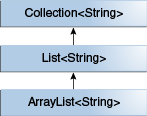

## 제너릭(Generic)

제너릭(generic)이란 데이터의 타입을 일반화(generalize)한다는 것을 의미한다. \
제너릭은 클래스나 메소드에서 사용할 내부 데이터 타입을 컴파일 시에 미리 지정하는 방법이다.

제너릭을 사용하면 다음과 같은 장점을 갖는다.

1. 클새스나 메소드 내부에서 사용되는 객체의 타입 안정성을 높일 수 있다.
2. 반환값에 대한 타입 변환 및 타입 검사에 들어가는 노력을 줄일 수 있다.
3. 비슷한 기능을 지원하는 경우 코드의 재사용성이 높아진다.

예를 들면 여러 타입을 사용하는 클래스나 메소드에서 인수나 반환 값으로 Object 타입을 사용한다 했을 때 반환된 Object 객체를 사용하려면 원하는 타입으로 타입 변환 해야되고, 이때 오류가 발생할 가능성도 존재한다. `instanceof` 예약어를 사용해 타입을 점검해가면서 타입 변환을 할 수 있지만 번거로운 작업이 될 것이다.

Oracle에서 제너릭을 설명하는 간단한 예제를 보자.

```java
/**
 * Generic version of the Box class.
 * @param <T> the type of the value being boxed
 */
public class Box<T> {
    private T t;

    public void set(T t) { this.t = t; }
    public T get() { return t; }
}
```

클래스 이름 옆의 <>의 parameter는 type parameter이며 type variable이라고 부르기도 한다. \
Java7 이후부터 Diamond로 부르기도 한다.

위의 Box 클래스에서 모든 Object의 생성은 T로 대체된다.

type variable은 class, interface, array 등등의 non-primitive type은 어떤 것이든 가능하다.

## 제네릭 타입

| 타입  |                  설명                   |
| :---: | :-------------------------------------: |
|   E   | 요소(Element, Collection에서 주로 사용) |
|   T   |                  타입                   |
|   K   |                   키                    |
|   V   |                   값                    |
|   N   |                  숫자                   |
| S,U,V |  두번째, 세번째, 네번째에 선언된 타입   |

제네릭 타입은 Value 같이 임의의 어떤 단어로 선언해도 상관없지만 자바에서 정의한 기본 규칙은 위의 표 처럼 되어있다.
누가 보더라도 쉽게 이해할 수 있도록 하려면 규칙을 따르는 것이 좋다.

## 제네릭의 형태

Java에서 제공하는 제너릭에는 다음과 같은 형태가 있다.

- 매개변수화 타입(Parameterized type)
- 언바운드 와일드카드 타입(Unbounded wildcard type)
- 바운드 타입 매개변수(Bounded type parameter)
- 재귀적 타입 바운드(Recursive type bound)
- 제네릭의 서브타이핑(Subtyping in generics)
- 와일드카드 서브 타이핑(Wildcard and subtyping)
- 바운드 와일드카드 타입(Bounded wildcard type)
- 제네릭 메소드(Generic method)

---

### 매개변수화 타입(Parameterized type)

하나 이상의 타입 매개변수를 선언하고 있는 클래스나 인터페이스를 제네릭 클래스, 제네릭 인터페이스라고 하며 이를 합쳐 제네릭 타입이라고 한다.
각 제네릭 타입에서는 매개변수화 타입들을 정의하는데 다음과 같은 것이다.

```java
List<Integer> list = new ArrayList<>();
```

<>안에 있는 Integer를 **실 타입 매개변수**라고 하며 `List<E>`의 E를 **형식 타입 매개변수**라고 한다. 제네릭은 **타입 소거자**에 의해 자신의 타입 요소정보를 삭제한다.

`E, List<E>, List<String>`과 같은 타입들을 비 구체화 타입이라고 하고 그 반대로 구체화 타입이 있으며, ```List<?>, Map<?,?>와 같은 언바운드 와일드 카드 타입 등이 있다.

> 비 구체화 타입(non-reifiable type): 타입 소거자에 의해 컴파일 타임에 타입 정보가 사라지는 것(런타임에 구체화 하지 않는 것)
> 구체화 타입(reifiable type): 자신의 타입 정보를 런타임 시에 알고 지키게 하는 것(런타임에 구체화 하는 것)

### 언바운드 와일드카드 타입(Unbounded wildcard type)

`List<?>`와 같은 타입을 언바운드 와일드 카드 타입이라고 한다.\
해석해보면 어떤 타입이 오든 관계가 없다는 것이다.

예제코드를 살펴보자.

```java
public static void main(String[] args) {
        List<Integer> list = new ArrayList<>();
        list.add(1);
        list.add(1000);
        list.add(2000);

        printListWildcard(list);
    }
public static void printListWildcard(List<?> list){
    for (Object o : list) {
        System.out.println(o);
    }
}
public static void printListInteger(List<Integer> list) {
    for (Integer o : list) {
        System.out.println(o);
    }
}

public static void printListString(List<String> list) {
    for (String o : list) {
        System.out.println(o);
    }
}
```

list의 객체를 하나씩 출력하는 함수다. 예제와 같이 제네릭의 타입 매개변수에 따라 메소드가 만들어지는 것을 볼 수 있다. 타입이 두 세개로 한정되있다면 메소드를 일일이 작성할 수 있겠지만 타입이 늘어날 수록 간단한 출력 메소드를 계속 작성하는 것은 매우 비효율 적이다.

그래서 <?> 같이 적어주면 어떤 타입이 제네릭 타입이 되어도 상관 없게 된다.

언바운드 와일드 타입이 사용될수 있는 경우는 다음과 같다.

1. Object 클래스에서 제공되는 기능을 사용하여 구현할 수 있는 메서드를 작성하는 경우.
2. 타입 파마리터에 의존적이지 않는 일반 클래스의 메소드를 사용하는 경우, `List.clear, List.size ....`

### 바운드 타입 매개변수(Bounded type parameter)

바운드 타입은 특정 타입으로 제한한다는 의미이다. 클래스나 인터페이스 설계 시 흔하게 사용한다.

예제 코드를 살펴보자

```java
public class Box <T extends Number>{
    private T value;

    public void setValue(T value) {
        this.value = value;
    }
}

public class BoxSample {
    public static void main(String[] args) {
        Box<Double> box = new Box<>();
        box.setValue(1.0);
        box.setValue("st");
        Box<Integer> box2 = new Box<>();
        box2.setValue(1);

        Box<String> box3 = new Box<>();
    }
}
```

Box 클래스의 타입으로 Number의 서브타입만 허용한다는 의미다. Wrapper 클래스는 추상클래스 Number를 상속받아 구현한 클래스이다.\
그래서 Box 객체를 생성할때 String타입으로 선언할 때와, Double타입의 box에 다른 타입의 값을 set할 때 컴파일 에러가 발생한다.

다중 바운드 타입이라는 것도 존재한다. 다중 바운드 타입은 하나의 클래스와 여러개의 인터페이스를 선언할 수 있다.

```java
class A{}
interface B{}
interface C{}

class D<T extends A & B & C> {

}
```

### 재귀적 타입 바운드(Recursive type bound)

재귀적 타입 바운드는 타입 매개변수가 자신을 포함하는 수식에 의해 한정될 수 있다. 타입의 자연율을 정의하는 `Comparable` 인터페이스와 가장 많이 사용된다.

> 자연율: 상식적인 관점에서 알 수 있는 순서를 말하며, 문자열은 알파벳 순으로, 숫자는 크기순으로 정해진다.

`Comparable` 인터페이스를 살펴보면 다음과 같다.

```java
public interface Comparable<T> {

    public int compareTo(T o);
}
```

타입 매개변수 T는 자신과 비교될 수 있는 요소를 정의한 것이다. `Comparable`을 구현하는 요소들의 목록을 정렬하거나, 최소,최댓값을 구하는 작업을 하기 위해서는 요소들이 서로 비교가 가능해야 한다.\

아래 코드는 최댓값을 구하는 코드이다.

```java
static <T extends Comparable<T>> T max(List<T> list) {
    Iterator<T> iterator = list.iterator();
    T result = iterator.next();
    while (iterator.hasNext()) {
        T t = iterator.next();
        if (t.compareTo(result) > 0) result = t;
    }

    return result;
}
```

`<T extends Comparable<T>>`는 "자신과 비교될 수 있는 모든 타입 T"라고 읽을 수 있다.

### 제네릭의 서브타이핑(Subtyping in genrics)

```java
Box<Number> box = new Box<>();
box.setValue(Integer.valueOf(10));
box.setValue(Double.valueOf(101.1));
```

`Box`클래스의 매개변수화 타입을 Number로 선언했고 `Integer, Double`은 서브타입이기 때문에 문제가 없다.
하지만 아래의 코드에서는 컴파일 에러가 발생한다.

```java
public static void boxTest(Box<Number> box) {
        System.out.println(box);
    }
boxTest(new Box<Number>());
boxTest(new Box<Integer>());
```

왜나하면 `Box<Integer>`는 `Box<Number>`의 서브타입이 아니기 때문이다.

<p align="center">
    
</p>

매개변수화 타입은 **무공변**이기 때문에 `Box<Number>`에서는 Number 타입만 허용하고 `Box<Integer>`에서는 Integer 타입만 혀용한다. 그래서 둘은 다른 존재다.\
제네릭 클래스나 인터페이스를 상속관계로 정의하고 싶으면 다음 그림과 같이 상속 관계를 정의해야 한다.

<p align="center">
    
</p>

```java
interface PayloadList<E,P> extends List<E>{
    void setPayload(int index, P val);
}
```

`PayloadList`는 `List<E>`를 상속받으며 타입 P를 추가적으로 선언했다.\
그래서 `PayloadList`는 다음과 같은 형태를 가질수 있게 된다.

- PayloadList <String, String>
- PayloadList <String, Integer>
- PayloadList <String, Exception>

<p align="center">
    
</p>

### 와일드카드 서브타이핑(wildcard and subtyping)

위의 경우를 다음과 같이 바운드 와일드카드 타입을 이용해서 Number의 서브타입을 같는 Box를 전달할 수 있다.

```java
public static void boxTest(Box<? extends Number> box) {
        System.out.println(box);
    }
boxTest(new Box<Number>());
boxTest(new Box<Integer>());
```

### 바운드 와일드카드 타입(Bounded wildcard type)

바운드 와일드 타입에는 2가지가 있다

- Upper bounded wildcard: `<? extends T>` **공변(covariant)** 아라고도 한다.
- Lower bounded wildcard: `<? super T>` **반공변(contravariance)** 이라고도 한다.

extends-bound, super-bound는 **PECS** (Producer-extends, Consumer=super)라는 개념으로도 사용된다.

```java
class Box{

}
class Package extends Box{

}

public static void test1(List<? extends Box> list){
    Box box = list.get(0);
    list.add(new Box()); //compile error
}

public static void test2(List<? super Box> list){
    Box box = list.get(0); //compile error
    list.add(new Box());
}
```

위의 코드를 보면 Producer-extends는 읽기만 가능하고 Consumer-super는 쓰기만 가능한 것을 알 수 있다.\
Oracle 문서에서는 In,Out 개념으로 가이드하고 있다. `copy(src, dest)라는 메소드가 있다고 가정하면 src는 복사할 데이터를 제공하므로 생산In 인자가 되고, dest는 다른곳에서 사용할 데이터를 받으므로 소비 Out 인자가 되므로 In의 경우 extends, Out의 경우는 super 키워드를 사용한다.

### 제네릭 메서드(Generic method)

메서드에도 마찬가지로 제네릭을 적용할 수 있다.

```java
public static void addItem(Box<?> box, int v) {
    box.setValue(v);
}
```

위의 코드는 인자 box에 인자 v의 값으로 변경 시키려는 메서드다. 하지만 와일드 카드를 사용할 경우 타입 매개변수마다 v의 타입이 맞아야 되기 때문에 컴파일 애러가 발생한다. <?>를 v 매개변수의 타입과 맞춰서 메서드를 작성할순 있지만 이 경우 많은 반복적인 코드를 작성해야된다.

이럴때 제네릭 메소드를 적용하면 해결 할 수 있다.

```java
public static <T> void addItem(Box<T> box, T v) {
    box.setValue(v);

public static void main(String[] args) {
    Box<String> box2 = new Box<>();
    //BoxSample.<String>addItem(box2,"10");
    BoxSample.addItem(box2,"10");
}
```

`BoxSample.<String>addItem(box2,"10")` 처럼 매개변수화 타입을 정의해줘야 하지만 타입 추론에 의해 생략 가능하다.

제네릭 메서드 또한 바운드 와일드카드를 적용할수 있다.

```java
public static <T extends Number> void addItem(Box<T> box, T v) {
    box.setValue(v);
}

public static <T,S extends Number> void addItem(Box<T> box, T v, S v2) {
    box.setValue(v);
}
```

위의 예제같이 작성이 가능하고, 하나 이상의 제네릭 타입 선언은 콤마로 구분하여 나열하면 된다.
