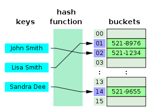

공부를 하다보니 HashCode, HashSet, HashMap 등 해시란 용어가 자주 언급이되서 더 자세히 알아보기 위해 글을 작성했다.

# 해싱이란?

해싱(Hashing)은 키값을 비교하여 찾는 검색 방법이 아니라 산술적인 연산을 이용하여 키가 있는 위치를 계산하여 바로 찾아가는 계산 검색 방식이다.
키값을 원소 위치로 변환하는 함수를 **해시 함수**(Hash Function)라고 하고, 해시 함수에 의해 계산된 주소 위치에 항목을 저장한 표를 **해시 테이블**(Hash Table)이라고 한다.
매핑 전 데이터의 값을 **키**, 해시함수를 이용해 매핑 후의 데이터 값을 **해시값**이라고 한다.
전산화되어 있는 도서 검색 시스템에서 제목을 입력하여 책의 위치를 찾는 것을 해싱의 예라고 할 수 있다.

## 해시 테이블

    

해시 테이블은 **키**(key),**해시함수**(Hash Fuction),**해시**(Hash),**값**(Value),**저장소**(Bucket,Slot)로 이루어져 있다. 해시함수를 사용해 키를 해시값으로 매핑하고, 이 해시값은 Index 혹은 주소로 데이터의 값을 키와 함께 저장하는 구조를 해시테이블이라고 한다. 이 때 데이터가 저장되는 곳을 버킷 또는 슬롯이라고 한다. 해시테이블의 기본 연산은 삽입, 삭제, 탐색이다.

## 동거자(Synonym)

모든 키값이 고르게 사용되는 건 아니다. 많이 사용되는 키값이 있을 수 있고 거의 사용되지 않는 키값이 있을 수 있다. 따라서 키값의 수만큼 버킷을 많이 만들면 메모리 공간이 낭비되기 때문에 해시테이블에서는 버킷 수를 줄이고 버킷안에 슬롯을 만들어 해시 함수로 만든 해시값이 같은 키값들을 같은 버킷에 저장한다. 이 처럼 서로 다른 키값을 가지지만 해시 함수에 의해 같은 버킷에 저장된 키값을 동거자라고 한다.

## 충돌(Collision)

키값이 서로 다름에도 불구하고 해시 함수에 의해 만들어진 해시 값은 같을 수가 있다. 이와같은 경우를 충돌이라고 한다. 충돌이 발생
