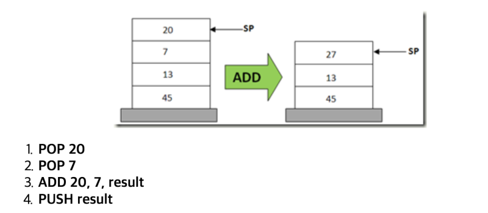
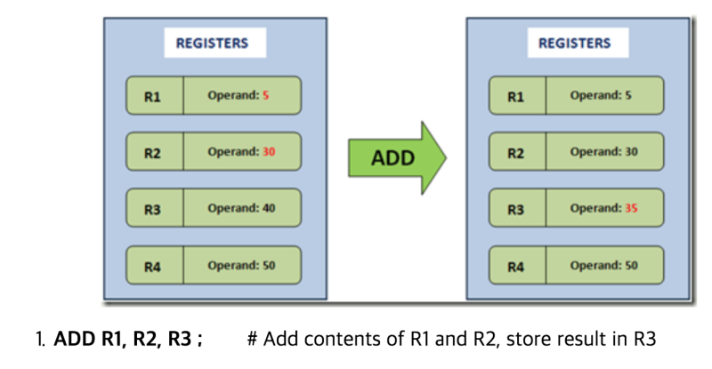
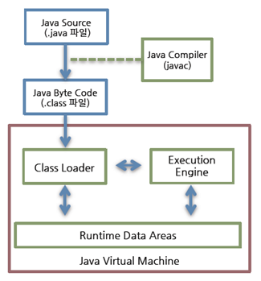
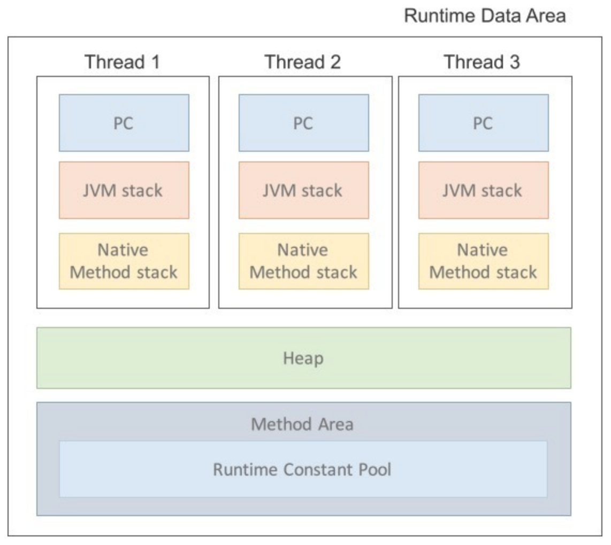

# Java Virtaul Machine

## JVM

JVM Java Virtual Machine 자바 가상 머신을 약자로 줄여놓은 용어이다. 가상머신이란 프로그램을 실행시키기 위해 물리적 머신과 유사한 머신을 소프트웨어로 구현한 것이라고 할 수 있다. JVM은 자바 어플리케이션을 클래스 로더를 통해 읽어 자바 API와 함께 실행시키는 역할을 한다.

JVM의 특징

- **스택 기반의 가상 머신**: 대표적인 컴퓨터 아키텍처인 인텔이나 ARM 아키텍처 같은 하드웨어는 레지스터 기반으로 동작하지만 JVM은 스택 기반으로 동작한다.
- **심볼릭 레퍼런스**: 기본 자료형을 제외한 모든 타입을 명시적인 메모리 주소 기반의 레퍼런스가 아니라 심복릭 레퍼런스를 통해 참조한다.
- **가비지 컬렉션(Garbage Collection)**: 클래스 인스턴스는 사용자 코드에 의해 명시적으로 생성되고 가비지 컬렉션에 의해 자동으로 파괴된다.
- **기본 자료형을 명확하게 정의하여 플랫폼 독립성 보장**: C/C++ 등의 언어는 플랫폼에 따라 int형의 크기가 변한다. JVM은 기본 자료형을 명확하게 정의하여 호환성을 유지하고 플랫폼 독립성을 보장한다.
- **네트워크 바이트 오더**: 자바 클래스 파일은 네트워크 바이트 오더를 사용한다. 인텔 x86 아키텍처가 사용하는 리틀 엔디안이나, RISC 계열 아키텍처가 주로 사용하는 빅 엔디안 사이에서 플랫폼 독립성을 유지하려면 고정된 바이트 오더를 유지해야 하므로 네트워크 전송 시에 사용하는 바이트 오더인 네트워크 바이트 오더를 사용한다. 네트워크 바이트 오더는 빅 엔디안이다.

### 스택 기반과 레지스터 기반의 차이

가장 큰 차이는 피연산자를 저장하고 다시 가져오는 메카니즘이 다르다.

### Stack 기반 가상 머신

- Java VM, Net Clr
- 대다수의 가상머신이 스택기반
- 피연산자와 연산 후 결과를 스택에 저장한다.
- 위의 경우 스택 구조이기 때문에 Push, Pop이 필요하며 4단계의 명령이 필요하다.
- 장점: 다음 피연산자의 메모리 위치를 기억할 필요가 없다. 스택에서 pop만 하면 피연산자가 나오기 때문에 메모리를 기억할 필요가 없다.

### Register 기반 가상 머신

- Lua VM, Dalvik VM
- 피연산자가 CPU의 레지스터에 저장된다.
- Push, Pop 연산자가 없다.
- 명령어가 피연산자의 위치인 레지스터의 주소를 기억해야 한다.
- 장점

  1. Pop, Push 과정이 없기 때문에 같은 덧셈이라도 하나의 명령으로 충분하다.
  2. 스택기반에서는 할 수 없는 명령어 최적화를 적용할 수 있다. 예) 어떤 연산이 나중에 또 필요할 때, 레지스터에 저장하여 다시 계산하지 않고도 결과를 활용할 수 있다.

- 단점
  1. 스택기반보다 명령어의 길이가 길다. 피연산자의 주소를 명시해줘야 하기 때문에.

### 심볼릭 레퍼런스

심볼릭 레퍼런스란 참고하는 클래스의 특정 메모리 주소를 참조 관계로 구성한 것이 아니라, 참조하는 대상의 이름만을 지칭한 것이다.

### JVM 구조

    

작성한 코드는 다음과 같은 과정을 통해 수행된다.
클래스 로더가 컴파일된 자바 바이트코드를 런타인 데이터 영역에 로드하고, 실행 엔진이 자바 바이트 코드를 실행한다.

### Class Loader

자바는 컴파일 타임이 아니라 런타임에 클래스를 처음으로 참조할 때 해당 클래스를 로드하고 링크하는 특징이 있다. 이 동적로드를 담당하는 부분이 클래스 로더이다.
클래스 로더의 특징으로는 다음이 있다.

- 계층 구조: 클래스 로더끼리 부모-자식 관계를 이루어 계층 구조로 생성된다. 최상위는 부트스트랩 클래스 로더이다.
- 위임 모델: 계층 구조를 바탕으로 클래스 로더끼리 로드를 위임하는 구조로 동작한다. 클래스를 로드할 때 상위 클래스 로더를 확인하여 해당 클래스 로더에 있다면 클래스를 사용하고, 없다면 로드를 요청받은 클래스로더가 클래스를 로드한다.
- 가시성 제한: 하위 클래스로더는 상위 클래스로더의 클래스를 찾을 수 있지만, 반대 경우는 찾을 수 없다.
- 언로드 불가: 클래스로더는 클래스를 로드할 수는 있지만 언로드할 수는 없다. 대신, 현재 클래스 로더를 삭제하고 아예 새로운 클래스로더를 생성하는 방법을 사용할 수 있다.

각 클래스로더는 클래스들을 보관하는 네임스페이스를 갖는다. 클래스를 로드할 때 이미 로드된 클래스인지 확인하기 위해서 네임스페이스에 보관된 FQCN(Fully Qualified Class Name)을 기준으로 클래스를 찾는다.

    

클래스 로더가 아직 로드되지 않은 클래스를 찾으면, 다음과 같은 과정을 통해 클래스를 로드하고 링크하고 초기화한다.

- 로드: 클래스를 파일에서 가져와서 JVM의 메모리에 로드한다.
- 검증: 읽어들인 클래스가 자바 언어 명세 및 JVM 명세에 명시된 대로 잘 구성되어 있는지 검사한다.
- 준비: 클래스가 필요로 하는 메모리를 할당하고, 클래스에서 정의된 필드, 메서드, 인퍼페이스들을 나타내는 데이터 구조를 준비한다.
- 분석: 클래스의 상수 풀 내 모든 심볼릭 레퍼런스를 다이렉트 레퍼런스로 변경한다.
- 초기화: 클래스 변수들을 적절한 값으로 초기화한다. static initializer들을 수행하고, static 필드들을 설정된 값으로 초기화한다.

### Runtime Data Area

런타임 데이터 영역은 JVM이 운영체제 위에서 실행되면서 할당받는 메모리 영역이다. 런타임 데이터 영역은 6개의 영역으로 나눌 수 있다.

- PC Register: 스레드가 시작될 때 생성되며 스레드마다 하나씩 존재한다. 스레드가 어떤 부분을 어떤 명령으로 실행해야할 지에 대한 기록을 하는 부분으로 현재 수행중인 JVM 명령의 주소를 갖는다.
- JVM Stack: 스레드의 수행 정보를 스택프레임을 통해서 저장한다. 메소드가 호출되면 메소드와 정보는 스택에 쌓이고 종료될 때 스택포인트에서 제거된다. 스택 프레임은 지역 변수 배열, 피연산자 스택, 현재 실행중인 메서드가 속한 클래스의 런타임 상수 풀에 대한 레퍼런스를 갖는다.
- Native method Stack: 자바 외의 언어로 작성된 네이티브 코드를 위한 스택이다.
- Method Area: 메소드 영역은 모든 스레드가 공유하는 영역으로 JVM이 시작될 때 생성된다. JVM이 읽어 들인 각각의 클래스와 인터페이스에 대한 런타임 상수 풀, 필드와 메서드 정보, static 변수,메서드의 바이트코드 등을 보관한다.
- Runtime Constant Pool: 클래스 파일 모맷에서 상수 풀 테이블에 해당하는 영역이다. 메스드 영역에 포함되있지만 JVM동작에서 가장 핵심적인 역할을 수행하는 곳이다. 각 클래스와 인터페이스의 상수뿐만 아니라, 메서드와 필드에 대한 모든 레퍼런스까지 담고 있는 테이블이다. 즉, JVM은 런타임 상수 풀을 통해 해당 메서드나 필드의 실제 메모리상 주소를 찾아 참조한다.
- Heap: 객체를 저장하는 공간으로 가비지 컬렉션의 대상이다. JVM 성능 등의 이슈에서 가장 많이 언급되는 공간이다.

### Execution Engine

런타임 데이터 영역에 배치된 바이트코드는 실행 엔진에 의해 실행된다. 실행 엔진은 명령어 단위로 읽어서 실행한다. 실행 엔진은 바이트 코드를 실제로 JVM 내부에서 기계가 실행할 수 있는 형태로 변경하며, 그 방식은 두가지가 있다.

1. 인터프리터: 명령어를 하나씩 읽어서 해석하고 실행한다. 바이트코드 하나하나의 해석은 빠른 대신 인터프리팅 결과의 실행은 느리다는 단점을 가지고 있다. 흔히 얘기하는 인터프리터 언어의 단점을 그대로 가지는 것이다.
2. JIL(Just-In-Time): 인터프리터의 단점을 보완하기 위해 도입된 것이 JIT 컴파일러이다. 인터프리터 방식으로 실행하다가 적절한 시점에 바이트코드 전체를 컴파일하여 네이티브 코드로 변경하고 실행하는 방식이다.
