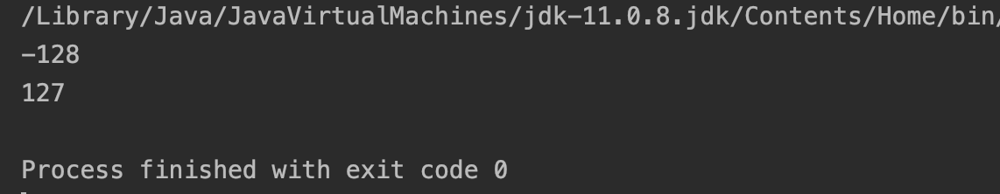
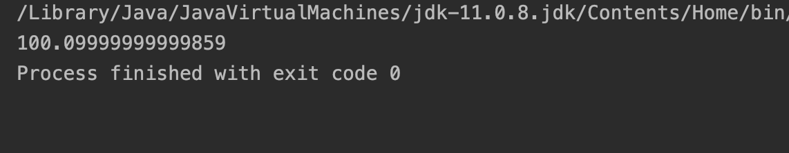
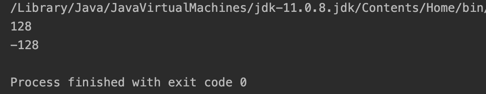

# 기본 자료형

데이터 타입은 데이터가 메모리에 어떻게 저장되고, 프로그램에서 어떻게 처리되어야 하는지를 명시적으로 알려주는 역할을 한다. 자바에서는 여려 형태의 타입을 미리 정의하여 제공하는데 이것을 기본 타입이라고 한다. 자바에는 8종류의 기본 타입이 제공되며, 크게 정수형, 실수형, 문자형, 논리형 타입으로 나눌 수 있다.

---

## 정수형 타입

자바의 기본 타입 중 정수를 나타내는 타입은 다음이 있다.

1. byte
2. short
3. int
4. long

각각의 정수형 타입에 따른 메모리의 크기 및 데이터의 표현 범위는 다음과 같다.

<!--
|제목|내용|설명|
|------|---|---|
|테스트1|테스트2|테스트3|
|테스트1|테스트2|테스트3|
|테스트1|테스트2|테스트3|
-->

| 타입  | 메모리 크기 | 표현 범위      |
| ----- | ----------- | -------------- |
| byte  | 1 byte      | -128~127       |
| short | 2 byte      | -2^15~2^15-1   |
| int   | 4 byte      | -2^31~2^31^-1  |
| long  | 8 byte      | -2^63^~2^63^-1 |
| char  | 2 byte      | 0~2^16^-1      |

char는 부호(unsigned)가 없기 때문에 같은 2바이트의 메모리를 같고 있어도 표현 범위가 많다.

그러면 나이 값(age)을 할당한다 했을 때 어떤 자료형을 사용해야 될까?? byte??

> 과거의 16비트 컴퓨터 생각하면 메모리가 640kbyte였다. 그래서 메모리의 관리에 신경을 써야되기 때문에 어떤 자료형을 선택해야하는지가 중요했지만, 하드웨어의 발달로 인한 메모리 공간의 증가로 크게 신경쓰지 않고 자바 정수형의 기본형인 int형을 사용하면 된다고한다.

### 오버플로우와 언더플로우

오버플로우란 해당 타입이 표현할 수 있는 최대범위보다 큰수를 저장할 때 발생하는 현상을 가리킨다.
반대로 언더플로우는 해당 타입이 표현할 수 있는 최소 범위보다 작은 수를 저장할 때 발생하는 현상을 가리킨다.

다음 예제를 보면 결과에 어떤 영향을 주는지 알 수 있다.

```java
public class Primitive {
    public static void main(String[] args) {
        byte num1 = 127;
        byte num2 = -128;

        num1++;
        num2--;

        System.out.println(num1);
        System.out.println(num2);
    }
}
```

실행 결과



byte타입의 표현 범위는 -128~127 이다. 위의 예제는 num1에 1을 더하고 num2에 1을 빼려고 한다. 그 결과 오버플로우와 언더플로우가 발생해 예상하지 못한 결과가 나오게된다.

저런 결과가 나오는 이유는 뭘까??

num1와 num2를 비트로 표현하면 다음과 같이 표현할 수 있다.

| num1  | 8   | 7    | 6    | 5    | 4    | 3    | 2    | 1    |
| ----- | --- | ---- | ---- | ---- | ---- | ---- | ---- | ---- |
| 2진수 |     | 2^6^ | 2^5^ | 2^4^ | 2^3^ | 2^2^ | 2^1^ | 2^0^ |
| 값    | 0   | 1    | 1    | 1    | 1    | 1    | 1    | 1    |

| num2  | 8   | 7    | 6    | 5    | 4    | 3    | 2    | 1    |
| ----- | --- | ---- | ---- | ---- | ---- | ---- | ---- | ---- |
| 2진수 |     | 2^6^ | 2^5^ | 2^4^ | 2^3^ | 2^2^ | 2^1^ | 2^0^ |
| 값    | 1   | 0    | 0    | 0    | 0    | 0    | 0    | 0    |

<table>
    <tr>
        <th>num1</th>
        <th>8</th>
        <th>7</th>
        <th>6</th>
        <th>5</th>
        <th>4</th>
        <th>3</th>
        <th>2</th>
        <th>1</th>
    </tr>
    <tr>
        <td>2진수</td>
        <td></td>
        <td>2<sup>6</sup></td>
        <td>2<sup>5</sup></td>
        <td>2<sup>4</sup></td>
        <td>2<sup>3</sup></td>
        <td>2<sup>2</sup></td>
        <td>2<sup>1</sup></td>
        <td>2<sup>0</sup></td>
    </tr>
        <tr>
        <td>값</td>
        <td>0</td>
        <td>1</td>
        <td>1</td>
        <td>1</td>
        <td>1</td>
        <td>1</td>
        <td>1</td>
        <td>1</td>
    </tr>
</table>

<table>
    <tr>
        <th>num2</th>
        <th>8</th>
        <th>7</th>
        <th>6</th>
        <th>5</th>
        <th>4</th>
        <th>3</th>
        <th>2</th>
        <th>1</th>
    </tr>
    <tr>
        <td>2진수</td>
        <td></td>
        <td>2<sup>6</sup></td>
        <td>2<sup>5</sup></td>
        <td>2<sup>4</sup></td>
        <td>2<sup>3</sup></td>
        <td>2<sup>2</sup></td>
        <td>2<sup>1</sup></td>
        <td>2<sup>0</sup></td>
    </tr>
        <tr>
        <td>값</td>
        <td>1</td>
        <td>0</td>
        <td>0</td>
        <td>0</td>
        <td>0</td>
        <td>0</td>
        <td>0</td>
        <td>0</td>
    </tr>
</table>

num1와 num2에 각각 1을 더하고 빼면 다음과 같은 결과가 된다.

<table>
    <tr>
        <th>num1</th>
        <th>8</th>
        <th>7</th>
        <th>6</th>
        <th>5</th>
        <th>4</th>
        <th>3</th>
        <th>2</th>
        <th>1</th>
    </tr>
    <tr>
        <td>2진수</td>
        <td></td>
        <td>2<sup>6</sup></td>
        <td>2<sup>5</sup></td>
        <td>2<sup>4</sup></td>
        <td>2<sup>3</sup></td>
        <td>2<sup>2</sup></td>
        <td>2<sup>1</sup></td>
        <td>2^0^</td>
    </tr>
        <tr>
        <td>값</td>
        <td>1</td>
        <td>0</td>
        <td>0</td>
        <td>0</td>
        <td>0</td>
        <td>0</td>
        <td>0</td>
        <td>0</td>
    </tr>
</table>

<table>
    <tr>
        <th>num2</th>
        <th>8</th>
        <th>7</th>
        <th>6</th>
        <th>5</th>
        <th>4</th>
        <th>3</th>
        <th>2</th>
        <th>1</th>
    </tr>
    <tr>
        <td>2진수</td>
        <td></td>
        <td>2<sup>6</sup></td>
        <td>2<sup>5</sup></td>
        <td>2<sup>4</sup></td>
        <td>2<sup>3</sup></td>
        <td>2<sup>2</sup></td>
        <td>2<sup>1</sup></td>
        <td>2<sup>0</sup></td>
    </tr>
        <tr>
        <td>값</td>
        <td>0</td>
        <td>1</td>
        <td>1</td>
        <td>1</td>
        <td>1</td>
        <td>1</td>
        <td>1</td>
        <td>1</td>
    </tr>
</table>

이렇게 오버플로우와 언더플로우가 어떻게 발생하는지 알아봤다.

## 실수형 타입

실수란 소수부나 지수부가 있는 수를 가리키며, 정수보다 훨씬 더 넓은 표현 범위를 가진다.

| 실수형 타입 | 할당되는 메모리 크기 | 지수의 길이 | 가수의 길이 | 유효 자릿수                        |
| ----------- | -------------------- | ----------- | ----------- | ---------------------------------- |
| float       | 4byte                | 8bit        | 23bit       | 소수 부분 6자리까지 오차없이 표현  |
| double      | 8byte                | 11bit       | 52bit       | 소수 부분 15자리까지 오차없이 표현 |

과거에는 float 형을 많이 사용했지만, 하드웨어의 발달로 인한 메로리 공간의 증가로 현재는 double형을 가장 많이 사용한다.
이 두 가지 타입은 간단한 계산에서는 사용해도 무방하지만, 돈 계산과 같이 정확하고,중요한 부분에서는 사용하면 안되고 BigDecimal 클래스를 사용해야 한다.

float과 double은 다음과 같이 정의되어 있다.

> float: single-precision 32-bit IEEE 754 floating point
>
> double: double-precision 64-bit IEEE 754 floating point

float은 "단정도 32비트 IEEE 754 부동 소수점", double은 "배정도 64비트 IEEE 754 부동 소수점" 이라고 한다.

그림으로는 아래와 같이 나타낼 수 있다.


부동소수점 방익은 숫자를 0과 1을 이용해서(근사해서) 표현하는 방식 중 하나이다.
IEEE 754 부동 소수점 표현에서 숫자는 **부호부**, **지수부**, **가수부**의 세부분으로 구성된다.

### 부동소수점 변환 예시

숫자 0.1을 부동소수점 방식으로 표현해 보겠다.

### 부호부

부호가 음수이므로 가장 앞자리는 0이 된다.

| 부호 | 지수 |     |     |     |     |     |     |     | 가수 |     |     |     |     |     |     |     |     |     |     |     |     |     |     |     |     |     |     |     |     |     |     |
| ---- | ---- | --- | --- | --- | --- | --- | --- | --- | ---- | --- | --- | --- | --- | --- | --- | --- | --- | --- | --- | --- | --- | --- | --- | --- | --- | --- | --- | --- | --- | --- | --- |
| 0    | -    | -   | -   | -   | -   | -   | -   | -   | -    | -   | -   | -   | -   | -   | -   | -   | -   | -   | -   | -   | -   | -   | -   | -   | -   | -   | -   | -   | -   | -   | -   |

### 가수부

숫자의 절대값을 2진수로 표현한다.
0.1은 2진수로 표현하면 다음과 같다.

$$0.0001100110011001100110011001100110011001100110011001101...._{(2)}$$

2 진수의 소수점을 왼쪽으로 이동시켜서 소수점 왼쪽에 1만 남도록 한다.

$$ 0.0001100110011001100110011001100110011001100110011001101...._{(2)} = 1.100110011001100110011001100110011001100110011001101...._{(2)} *2^{-4} $$

이 방식을 정규화된 표현 방식이라고 한다.

그리고 소수점의 오른쪽 부븐을 가수부 23비트의 앞에서 부터 채워준다.

| 부호 | 지수 |     |     |     |     |     |     |     | 가수 |     |     |     |     |     |     |     |     |     |     |     |     |     |     |     |     |     |     |     |     |     |     |
| ---- | ---- | --- | --- | --- | --- | --- | --- | --- | ---- | --- | --- | --- | --- | --- | --- | --- | --- | --- | --- | --- | --- | --- | --- | --- | --- | --- | --- | --- | --- | --- | --- |
| 0    | -    | -   | -   | -   | -   | -   | -   | -   | 1    | 0   | 0   | 1   | 1   | 0   | 0   | 1   | 1   | 0   | 0   | 1   | 1   | 0   | 0   | 1   | 1   | 0   | 0   | 1   | 1   | 0   | 0   |

자리가 남는다면 0으로 채워주고 지금은 비트를 초과해 중간에 잘리게 되었다.

### 지수부

지수는 -4이다.
지수에 bias인 127을 더해준다.(bias는 2^k-1^로 주어지는데 k는 지수부의 비트수 이다.)
-4에 bias를 더한 123을 2진수로 변환하면 01111011~(2)~이 된다. 그리고 변환한 값을 8비트 지수부에 채워주면 다음과 같은 결과가 나온다.

| 부호 | 지수 |     |     |     |     |     |     |     | 가수 |     |     |     |     |     |     |     |     |     |     |     |     |     |     |     |     |     |     |     |     |     |     |
| ---- | ---- | --- | --- | --- | --- | --- | --- | --- | ---- | --- | --- | --- | --- | --- | --- | --- | --- | --- | --- | --- | --- | --- | --- | --- | --- | --- | --- | --- | --- | --- | --- |
| 0    | 0    | 1   | 1   | 1   | 1   | 0   | 1   | 1   | 1    | 0   | 0   | 1   | 1   | 0   | 0   | 1   | 1   | 0   | 0   | 1   | 1   | 0   | 0   | 1   | 1   | 0   | 0   | 1   | 1   | 0   | 0   |

### 부동 소수점 방식의 오차

부동 소수점 방식을 사용하면 고정 소수점 방식보다 훨씬 더 많은 범위까지 표현할 수 있다.
하지만 위의 변환을 보면 한정된 범위의 가수부 비트에 값을 넣은 것을 볼 수 있다. 그래서 부동 소수점 방식에 의한 실수 표현은 근사치를 표현할 뿐이지 오차가 존재한다.

```java
public class Primitive {
    public static void main(String[] args) {
        double num = 0.1;

        for(int i = 0; i < 1000; i++) {
            num += 0.1;
        }
        System.out.print(num);
    }
}
```

실행 결과


위의 예제의 결과화면을 보면 오차가 발생한것을 확인할 수 있다.

## 논리형 타입

논리형은 참(true)이나 거짓(false) 중 한 가지 값만을 가질 수 있는 불리언 타입을 의미한다.

| 논리형 타입 | 메모리 크기 | 표현범위        |
| ----------- | ----------- | --------------- |
| boolean     | 1byte       | true 또는 false |

boolean형의 기본값은 false이며, 1byte의 크기를 가진다.

## 형 변환(casting)

형 변환은 서로 다른 타입 사이에 변환하는 작업을 말한다.
기본 자료형에서는 논리형 타입을 제외하고 형 변환이 가능하다.

```java
byte byteValue = 127;
short shortValue = byteValue;
```

다음과 같이 범위가 작은 타입에서 큰 타입으로의 변환은 별도의 명시 없이도 형변환이 이루어진다.

```java
byte byteValue = 127;
short shortValue = byteValue;
byteValue = (byte)shortValue;
```

하지만 범위가 큰 타입에서 작은 타입으로 다운캐스팅 할때는 변환되는 타입을 명시해 줘야된다.

```java
public static void main(String[] args) {
        byte byteValue = 127;
        short shortValue = byteValue;

        shortValue++;
        System.out.println(shortValue);
        byteValue = (byte)shortValue;
        System.out.println(byteValue);
    }
```

byteValue를 short로 형변환을 해서 ++연산자로 증가 시키고 다시 byte로 변환을 하면 어떤 결과가 나올까?

실행 결과


short의 128를 byte로 변환시키면 다음과 같은 상태가 된다.

<table>
    <tr>
        <th>byteValue</th>
        <th>8</th>
        <th>7</th>
        <th>6</th>
        <th>5</th>
        <th>4</th>
        <th>3</th>
        <th>2</th>
        <th>1</th>
    </tr>
    <tr>
        <td>2진수</td>
        <td></td>
        <td>2<sup>6</sup></td>
        <td>2<sup>5</sup></td>
        <td>2<sup>4</sup></td>
        <td>2<sup>3</sup></td>
        <td>2<sup>2</sup></td>
        <td>2<sup>1</sup></td>
        <td>2<sup>0</sup></td>
    </tr>
        <tr>
        <td>값</td>
        <td>1</td>
        <td>0</td>
        <td>0</td>
        <td>0</td>
        <td>0</td>
        <td>0</td>
        <td>0</td>
        <td>0</td>
    </tr>
</table>

맨 앞의 비트는 부호를 나타내는 비트이므로 무시가 되서 -128이라는 결과가 나오게 된다.
이와 같이 범위가 작은 타입으로 형 변환을 하게되면, 예상치 못한 결과가 나올 수 있으므로 주의해야된다.
