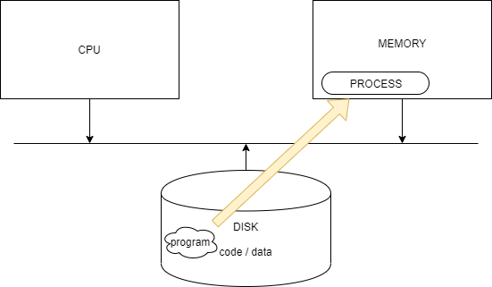

## 프로세스란?

프로세스의 정의는 다음과 같다.

> "A process is a program in excution"

실행 중인 프로그램을 프로세스라고 한다.\
그럼 프로그램과 프로세스의 차이는 뭘까??

- 프로그램: 디스크에 저장되어있는 일련의 명령어들의 집합(.exe같은 파일 시스템에 존재하는 실행파일)
- 프로세스: 그 프로그램이 **메모리**에 적재되어 실행중인 프로그램이 프로세스이다.

    

간단히 말하면 프로그램은 실행중이지 않은, 동작되고 있지 않은 **정적인 개채**라고 할 수 있고 프로세스는 실행중인 **동적인 개채**라고 표현 할 수 있다.

프로세스는 운영체제에서 작업의 단위라 할 수 있고, CPU time, memory, files, I/O devices같은 자원들을 관리할 수 있어야 된다.

프로세스는 다음과 같은 여러개의 섹션의 구조로 되어있다.

    

- Text section: 명령어 코드, program counter, 프로세스의 레지스터 정보를 같고 있다.
- Data section: 전역 변수. uninitialized data, initialzied data로 구성되어있다.
- Heap section: 런타임 동안 동적으로 할당된 메모리 영역
- Stack section: 함수가 호출될 때 생기는 일시적인 데이터.(function parameter, return address, local variables)

### 프로세스의 상태

프로세스는 다음과 같은 상태를 가지고 있다. 운영체제는 이 상태로 프로세스의 라이프 사이클을 관리하게 된다.

- New: 프로세스가 생성된 상태
- Running: 프로세스의 명령어를 CPU에 로드해서 실행시키는 상태. 프로세스 수행이 완료되기전에 할당 시간이 끝나면 프로세스는 다시 준비상태로 전이된다.\
  준비상태에서 실행상태로의 전이는 **CPU Schedular**에 의해 수행된다(dispatch)
- Waiting: 이벤트가 발생하여 프로세스가 대기하는 상태(I/O가 완료될 때 까지)
- Ready: 프로세스가 할당되기까지 대기하는 상태이다.
  Ready Queue에서 실행을 준비한다.
- Terminated: 프로세스가 종료되는 상태

    

### PCB(Process Control Block)

그럼 이 프로세스들을 어떻게 관리할까??

운영체제는 프로세스를 제어하기 위해 PCB(Process Control Block)라는 프로세스의 상태 정보를 저장하는 구조체를 사용한다. TCB라고도 불린다.

PCB는 프로세스 상태관리와 **문맥교환**(Context Switch)를 위해 필요하고 각 프로세스가 생성될 때마다 고유의 PCB가 생성되고 프로세스가 완료되면 PCB는 제거된다.

PCB는 다음과 같은 정보를 포함하고 있다.

    

- Process ID: PID
- Process State: 프로세스의 상태 정보
- Program Counter: 실행될 다음 명령어의 주소
- Register: Accumulator, CPU Register, General Register 등을 포함한다.
- CPU Scheduling Information: 우선 순위, 최종 실행시간, CPU 점유시간 등이 포함된다.
- Memory Management Information: 프로세스의 메모리 위치 정보와 메모리 보호를 위한 경계 레지스터 값, 한계 레지스터 값 등이 저장된다.\
  이외에도 세그먼테이션 테이블, 페이지 테이블 등의 정보도 보관한다.
- Accounting Information: CPU 사용시간과 경과된 시간, 시간제한, 계정 번호 등을 포함한다.
- I/O status Information: 프로세스에 할당된 입출력 장치들과 열린 파일의 목록 등을 포함한다.

기본적으로 프로세스란 프로그램이 "single thread of execution" 즉 하나의 실행 단위를 수행하는 것 이라고 할 수 있다.

운영체제는 프로세스의 개념을 확장해 한번에 여러 개의 프로세스를 작업할 수 있게 해주고 이를 **multiprocessing**라고 한다.

하지만 시간이 지날수록 프로세스 안에서 single thread of execution으로 관리가 어려워지고 이를 해결하기 위해
프로세스를 경량화 시킨 thread라는 개념이 나오고 한 프로세스 안에 여러개의 thread가 존재하게 되고 multithread로 작업을 처리하게 된다.\
Thread는 나중에 다시 포스팅 하겠다.

### Process Scheduling

멀티프로그래밍의 목적은 여러개의 프로세스를 동시에 실행시켜 CPU 사용률의 최대화 시킴에 있다.

time sharing은 CPU에 할당되는 프로세스를 자주 변경시킴으로 사용자에게 동시에 실행되는 것 처럼 느끼게 하는 것에 목적이 있다.

이를 제대로 이용하기 위해 Scheduling Queus를 사용한다.

    

- 프로세스가 시스템에 진입할 때, Ready Queue에 들어가게 되고 Dispatch를 통해 CPU에 로드된다.
- 프로세스는 어떤 이벤트가 발생하면 Wait Queue에 들어가게 된다.

이 큐들은 PCB들의 linked list로 구현된다.

#### Queueing Diagram

    

위의 Queueing Diagram을 보면 이벤트가 발생함에 따라 프로세스의 wait 상태로 변하고 다시 ready 상태로 변해 대기하는 모습을 보여준다.
