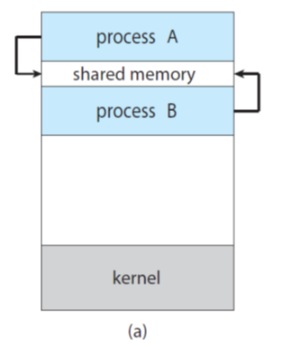
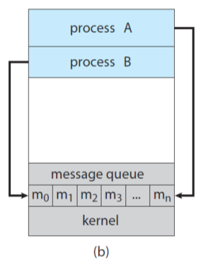
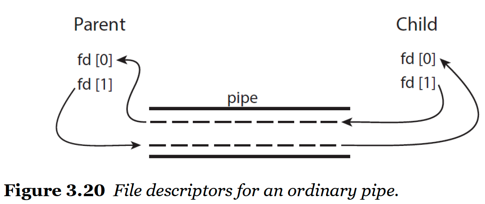
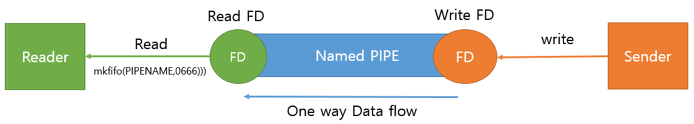
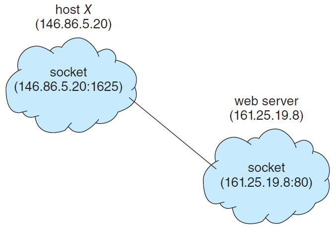
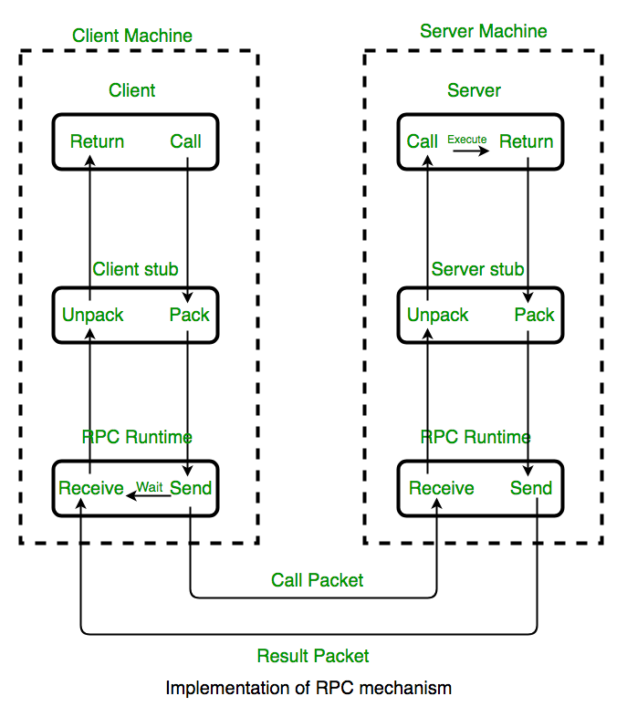

## IPC란

<p align="center">
    
</p>

프로세스는 독립적으로 실행되거나 서로 협력하면서 실행될 수 있다. 독립적이란 말은 다른 프로세스들과 데이터를 공유하지 않는다는 것이고 반대로 협력적이라는 것은 다른 프로세스들과 데이터를 공유한다는 것이고 다른 프로세스에 영향을 주거나 받을 수 있다. 이때 프로세스들의 통신을 IPC(inter process communication)이라고 한다.

## IPC의 통신 방법

특정 프로세스A에서 생산하면(produce) 특정 프로세스B에서 소비하는(consumer) 프로세스의 구조에서 데이터 통신 방법은 두가지가 있다

1. 공유 메모리(Shared Memory)
2. 메세지 전달(Message Passing)

각각의 통신 방법에 대해 알아보자.

## 공유 메모리(shared memory)

<p align="center">
    
</p>

공유 메모리는 프로세스간 특정 메모리 영역을 공유해서 사용할 수 있도록 한다. 프로세스가 공유 메모리 할당을 커널에 요청하면 커널은 해당 프로세스에 메모리 공간을 할당해준다.\
이 공유 메모리에 생산자는 buffer를 채우고 소비자는 buffer를 비운다.

공유 메모리 방식은 다른 방식에 비해 속도가 빠르지만 메모리에 접근하고 데이터를 다루는 것을 모두 프로그래머가 명시적으로 코드를 작성해줘야하는 불편함이 있었다.

## 메세지 전달(message passing)

<p align="center">
    
</p>

메세지 전달 방식은 프로세스간 데이터 통신 수단을 O/S에서 제공해주는 것을 말한다. 생상자는 전송 메소드 send(), 소비자는 응답 메소드 receive()를 사용하고 커널에서 내부 buffer를 관리한다.\
메세지 전달 방식은 일반적인 경우 공유 메모리 방식 보다 속도는 느리지만 커널이 기본적인 기능을 제공하므로 공유 메모리 방식보다 구현이 쉬운 점이 있다.

프로세스간 message passing을 위해서 communication links가 만들어지는데 이 links의 구현은 다음과 같은 방식이 있다.

- direct or indirect
- synchronous or asynchronous
- automatic or explicit buffering

### direct

프로세스끼리 통신을 하기 위해선 서로를 칭하는 명시적인 이름이 있어야 한다. 이를 다음과 같이 가정할 수 있다.

- sender : message를 보내는 process, send( process_B, message )
- recipient : message를 받는 process, receive( process_A, message )

이렇게되면 프로세스A와 프로세스B 사이에 link가 하나만 생기게 되고 이렇게 프로세스끼리 직접 link되어 communication 하는 것을 direct communication이라고 한다.

위의 상황같이 발신자와 수신자 둘 다 서로의 이름을 표기하면 **symmentry**라고 하고, 발신자만 이름을 표기하고 수신자는 아무것도 표기하지 않는 것을 **asymmentry**라고 한다. 아래와 같은 경우이다.

`send (process_A, message) -----> receive (message) `

direct communication 방식은 두 프로세스간에만 데이터를 주고 받을 수 있고, 명시적이기 때문에 하드코딩 되어있다는 단점이 있다.

### indirect

프로세스끼리 직접 communication 하는 것이 아니라 mailbox or port를 통해 message를 주고 받는 것을 indirect communication 이라고 한다.\
mailbox는 고유의 id가 있는데 다음과 같이 나타낼 수 있다.

- send(A, message) - mailbox A에게 message를 전달
- receive(A, message) - mailbox A에게 message를 받음

### synchronous or asynchronous

blocking과 non-blocking 이라고도 하며 동기적으로 구현하는 방식과 비동기적으로 구현하는 방식의 차이가 있다.

|                     |                                                                          |
| ------------------- | ------------------------------------------------------------------------ |
| Blocking send       | 수신자 프로세스나 mailbox가 메세지를 받을 때 까지 메세지를 보낼 수 없다. |
| Nonblocking send    | 발신자 프로세스가 메일을 보내고 다시 자기 일을 한다.                     |
| Blocking receive    | 메세지가 이용될 수 있을 때까지 아무것도 할 수 없다.                      |
| Nonblocking receive | 수신자 메세지가 valid한 메세지 혹은 null을 복구한다.                     |

### automatic or explicit buffering

automatic buffering은 무한한 길이의 큐를 제공하고 explicit buffering은 버퍼의 크기를 명시한다. 구현을 세가지 방법으로 정리하면 아래 표와 같다.

|                    |                                                                                                                                                                                                            |
| ------------------ | ---------------------------------------------------------------------------------------------------------------------------------------------------------------------------------------------------------- |
| zero capacity      | queue의 buffer가 0이기 때문에 메세지를 보낼 때 마다 block이 된다. 다시 말해, 수신자가 메세지를 받을 때 까지 block된다.                                                                                     |
| bounded capacity   | queue의 길이가 유한인 n이다. 즉, n개의 메세지만 queue에 push할 수 있다. queue의 buffer가 남았으면 메세지를 보낼 수 있지만, 꽉 차면 block이 된다. 수신자가 메세지를 읽어서 queue가 빌 때까지 기다려야 한다. |
| unbounded capacity | queue의 길이가 무한대이기 때문에, 발신자는 절대 block되지 않는다.                                                                                                                                          |

## IPC의 예시

그럼 앞서 말한 공유 메모리 방식과 메세지 전달 방식이 어떻게 구현이 되어있는지 알아보자.

### POSIX Shared Memory

memory-mapped files 방식으로 공유 메모리 객체를 프로세스 메모리에 매핑하는 방식이다.

```c
/*
create the shared memory object
*/
shm_fd = shm_open( O_CREAT O_RDWR, 0666)

/*
configure the size of the shared memory
*/
ftruncate(shm_fd, SIZE)

/*
map the shared memory object
*/
ptr = (char*)mmap(0, SIZE, PROT_READ PROT_WRITE, MAP_SHARED, shm_fd, 0)
```

`shm_open`으로 공유 메모리 객체를 생성하고 `ftruncate`로 메모리 공간을 설정한다. 그리고 `mmap`을 통해 매핑을 해서 사용한다.

### Ordinary Pipe

message passing의 예시로는 Pipe가 있다. 그중에서 Ordinary Pipe를 알아보겠다.

<p align="center">
    
</p>

Ordinary Pipe는 두 프로세스가 produce-consumer 관계로 데이터를 주고 받는데, 커뮤니케이션은 단방향 통신이다.\
위의 그림은 parant process에서 pipe()로 pipe를 생성하고, fork()로 child process를 생성해 pipe를 통해 데이터를 주고 받는 모습이다.
fd(0)은 read end를 fd(1)은 write end를 의미한다.\
앞서 말한대로 pipe는 단방향 커뮤니케이션이라 했는데 양방향 커뮤니케이션을 하기 위해서는 두 개의 pipe를 만들면 된다.

### Named Pipe

<p align="center">
    
</p>

앞서 설명한 Ordinary pipe는 두 프로세스가 parent-child 관계를 갖고 있을 때 프로세스가 데이터를 주고 받는 방법에 대한 것이다.\
Namde pipe는 이름이 있는 파일을 사용해 parent-child 관계가 아닌 프로세스끼리도 통신을 가능하게 한다. named pipe는 mkfifo 명령어로 생성할 수 있다.

하지만 ordinary pipe와 마찬가지로 단방향 통신이며 쌍방향 통신을 위해서는 pipe를 두 개 생성해줘야 한다.

## client-server 관계의 서로 다른 PC의 프로세스 통신

위의 방식들은 하나의 PC에서의 프로세스 통신 방식이다. 그렇다면 client-server 관계의 서로 다른 PC의 프로세스는 어떻게 데이터를 주고 받을까?

다음과 같은 방법이 있다.

- 소켓(Socket)
- 원격 프로시저 호출(RPC Remote Procedure Call)

### 소켓(Socket)

<p align="center">
    
</p>

소켓은 서로의 endpoint를 특정할 수 있는 IP 주소와 프로세스간의 pipe를 지정하는 port로 이루어져있다. 그래서 이 정보들을 통해서 클라이언트는 네트워크를 통해 서버 프로세스에 접근할 수 있다.

Java의 경우 TCP, UDP, BroadCast를 지원한다.

### 원격 프로시저 호출(RPC Remote Procedure Call)

<p align="center">
    
</p>

> 원격 프로시저 호출(영어: remote procedure call, 리모트 프로시저 콜, RPC)은 별도의 원격 제어를 위한 코딩 없이 다른 주소 공간에서 함수나 프로시저를 실행할 수 있게하는 프로세스 간 통신 기술이다. 다시 말해, 원격 프로시저 호출을 이용하면 프로그래머는 함수가 실행 프로그램에 로컬 위치에 있든 원격 위치에 있든 동일한 코드를 이용할 수 있다.
>
> From wikipedia

현재 유행하는 MSA(Micro Service Architecture) 구조로 서비스를 만들다보면, 다양한 언어와 프레임워크로 개발되는 경우가 많다. 이런 Polyglot한 구조에서는 프로토콜을 맞춰서 통신해야하는 비용이 발생한다. 이러한 경우 RPC를 이용하여 언어에 구애받지 않고, 원격에 있는 프로시저를 호출하여 좀 더 비즈니스 로직에 집중할 수 있게 한다.

위의 설명대로 RPC는 원격지의 프로세스에 접근하여 프로시저 또는 함수를 호출하여 사용한다. 분산 컴퓨팅 환경에서 프로세스 간 상호 통신 및 컴퓨팅 자원의 효율적인 사용을 위해서 발전된 기술이다.

프로시저와 함수의 차이

- 함수는 인풋에 대비한 아웃풋의 발생을 목적으로 한다.
- 프로시저는 결과 값에 집중하기 보단 '명령 단위가 수행하는 절차'를 목적으로 한다.

RPC의 궁극적인 목표

- 클라이언트-서버 간의 커뮤니케이션에 필요한 상세정보는 최대한 감춘다.
- 클라이언트는 일반 메소드를 호출하는 것처럼 원격지의 프로지서를 호출할 수 있다.
- 서버도 마찬가지로 일반 메소드를 다루는 것처럼 원격 메소드를 다룰 수 있다.

## 마치며

이전 포스팅 프로세스의 개념에 이어서 이번 포스팅에서는 IPC에 대해서 알아보았다.

프로세스들이 어떻게 통신을 하는지 자세히 알게되고 이름만 접했던 Socket에 대해서도 더 자세히 알게된 것 같다. RCP는 나중에 따로 포스팅해 더 자세히 다뤄야될 것 같다.

다음은 쓰레드에 대해서 포스팅하겠다.
