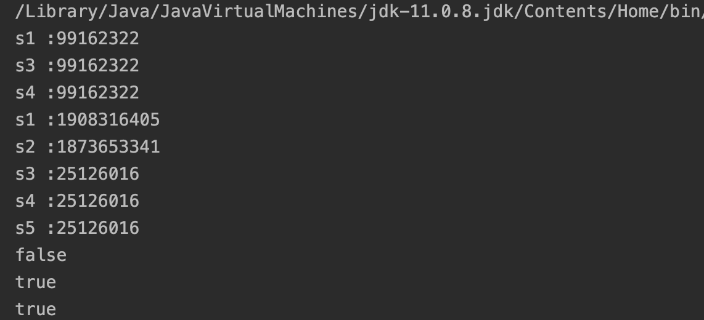

## String Constant Pool

`String` 의 두가지 생성 방식이 있고 각각의 차이점이 있다.

1. `new` 를 이용한 생성 방식
2. 리터럴을 이용한 생성 방식

두 가지 방식의 큰 차이점은 `new` 연산자로 String 객체를 생성하면 Heap 영역에 객체를 저장하고, 리터럴로 String 객체를 생성하면 내부적으로 `String의 intern()`메소드가 호출되고 **String Constant Pool** 이라는 영역에 존재하게 된다. String Constant Pool 영역은 Heap 영역 내부에서 String 객체를 관리 위해 별도로 공간이 제공되고 있다. 이 공간에 문자열을 저장하고 사용하는 것을 **String Interning**이라고 한다.

String Interning은 다음의 흐름으로 값을 찾는다.

1. String 값이 String Constant Pool에 있는지 찾는다.
2. 있다면 그 문자열 객체의 주소 값을 반환한다.
3. 값이 없다면 String Constant Pool에 해당 값의 String 객체를 생성하고 주소 값을 반환한다.

String Constant Pool을 이용하면 같은 값은 메모리에 추가 할당 없이 재사용이 가능하다는 장점을 가지고 있다.

```java
public class StringPoolTest {
    public static void main(String[] args) {
        String s1 = new String("hello");
        String s2 = new String("hello");

        String s3 = s1.intern();
        String s4 = "hello";
        String s5 = "hello";

        System.out.println("s1 :"+s1.hashCode());
        System.out.println("s3 :"+s3.hashCode());
        System.out.println("s4 :"+s4.hashCode());

        System.out.println("s1 :"+System.identityHashCode(s1));
        System.out.println("s2 :"+System.identityHashCode(s2));
        System.out.println("s3 :"+System.identityHashCode(s3));
        System.out.println("s4 :"+System.identityHashCode(s4));
        System.out.println("s5 :"+System.identityHashCode(s5));

        System.out.println(s1==s2);
        System.out.println(s3==s4);
        System.out.println(s1.equals(s3));

    }
}
```

실행 결과



eqauls,==에 대한 포스팅은 [eqauls와 ==의 차이](https://hojoon7807.github.io/equals/) 포스팅을 보면 된다.

실행 결과를 보면 new() 연산자로 생성된 객체 s1,s2는 같은 문자열값을 가지지만 주소값이 다른 것을 확인 할 수 있다. s3는 intern() 메소드를 사용하여 `"hello"`가 위에서 설명한 흐름을 통해 String Constant Pool 영역에 값이 생성된 것을 확인 할 수 있다. 그래서 s3, s4도 위의 결과를 가진다.
hashCode()의 결과가 모두 같은 이유는 String에 오버라이딩된 코드를 보면 문자열의 값을 이용해 hash 값을 생성하기 때문에 그렇다.

## Java 버전에 따른 String Constant Pool의 변화

### Java 6 이전

Java 6 이전에서는 String Constant Pool은 PermGen(Permenent Generation)영억에 있었다. 하지만 PermGen은 사이즈가 고정된 영역이었기 때문에 많은 String 데이터를 사용하면 OOM(Out Of Memory) 문제를 발생시킬수 있었다.

### Java 7

Java 7 버전으로 올라오면서 String Constant Pool은 Heap 영역으로 위치가 옮겨졌다. 더 이상 고정된 크기의 메모리 영역에 제한을 받지 않게 됐다.
또 String Constant Pool의 모든 문자열도 **GC(Garbage Collection)**의 대상이 된다.

## StringTableSize

String Constant Pool은 기본적으로 해시테이블 구조를 가지고 있다. String을 해싱하고 그것을 키로 하여 값을 찾기 때문에 좋은 성능을 발휘할 수 있다. 해시테이블의 버킷 크기는 Java 버전 마다 차이가 있고 크기는 변경이 가능하다.
