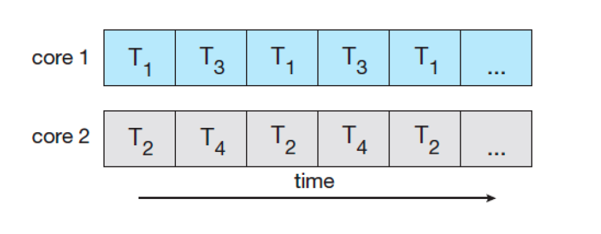

## 쓰레드란??

이전 포스팅에서 프로세스에 대해 알아보았다.\
프로세스는 간단히 설명하면 프로그램이 메모리에 올라가 CPU를 할당받은 실행중인 프로그램이라고 말할 수 있다. 그리고 프로그램을 수행하는데 필요한 데이터와 메모리 등의 자원 그리고 쓰레드로 구성되어 있으며 이 자원들을 이용해 실제로 작업을 수행하는 실행되는 흐름의 단위를 **쓰레드**라고 한다.

쓰레드는 lightweight-process라고도 하며 한 번에 하나의 작업만 수행하는 것을 싱글 쓰레드, 하나의 프로세스가 동시에 여러 작업을 수행하는 것을 멀티 쓰레드라고 한다.

    

여러개의 프로세스가 있을때 각각의 프로세스는 독립적인 메모리 영역을 가진 반면,\
쓰레드는 각각 Stack, PC(program counter), registers 영역을 가지고 code, data, heap 영역을 공유한다.

## 멀티쓰레드

그럼 기존의 멀티 프로세스 방식 대신에 멀티쓰레드를 사용할까? 각각에 대해서 간단히 알아보자.

### 멀티 프로세스

각각의 프로세스들은 독립된 메모리 영역을 가진다. 프로세스간 통신하기 위해서는 IPC를 사용해야 한다.\
여러개의 프로세스 중에서 하나가 죽어도 다른 프로세스에 영향을 미치지 않는다.

### 멀티 쓰레드

하나의 프로세스가 다수개의 작업을 각각의 쓰레드를 통하여 동시에 실행할 수 있고, 독립적인 프로세스처럼 작업을 수행한다.\
대표적인 예시로 웹서버가 있다.

    

클라이언트에서 요청이 오면 서버에서는 쓰레드를 생성해 요청 작업을 수행해서 이 후에 추가되는 요청도 계속해서 받을 수 있다.

멀티 쓰레드의 장점을 정리하면 다음과 같다.

- 쓰레드는 프로세스의 자원을 공유해서 사용하기 때문에 프로세스와 달리 쓰레드간에 데이터를 주고 받는 것이 간단해지고 시스템 자원 소모가 줄어든다.
- 멀티 프로세스로 실행되는 작업을 멀티 쓰레드로 실행할 경우, 프로세스를 생성하여 자원을 할당하는 시스템 콜이 줄어들어 자원을 효율적으로 관리 가능하다.
- 프로세스의 문맥 교환에 비해 쓰레드의 문맥 교환은 오버헤드가 더 작다.
- 확장성이 용이하다.

단점도 존재한다. 위의 내용대로 쓰레드들은 프로세스의 자원을 공유해서 같이 사용하기 때문에 동기화 작업이 이루어지지 않는다면 데이터의 일관성이 문제가 생길 것이다. 또 하나의 쓰레드에 오류가 생기면 같은 프로세스 내의 다른 쓰레드들도 모두 강제 종료가 된다.

## Multicore Programming

멀티코어 시스템을 구현할 때는 동시성(Concurrency)와 병렬성(Parallelism)을 알아야 한다.\
동시성은 싱글 코어 시스템에서 사용되는 방식으로, 프로세서가 여러개의 쓰레드를 번갈아가면서 수행함으로 동시에 실행되는 것처럼 보이게 하는 방식이다.

    

시분할을 통해 쓰레드들을 수행하는 모습을 볼 수 있다.

병렬성은 멀티 코어 시스템에서 사용되는 방식으로, 여러개의 코어가 각 쓰레드를 동시에 수행하는 방식이다.

    

parallelism은 data parallelism과 task parallelism 두 가지로 구분할 수 있는데 다음과 같이 말할 수 있다.

- Data: 작업량의 분배 ex) 1~100을 더해야 하는 경우 cpu1는 1~50까지의 데이터를, cpu2는 51~100까지의 데이터를 계산한 후에 합친다.
- Task: 하는 업무의 분배 ex) 1~50은 더하고, 51~100은 곱해 합산한다. cpu1은 더하는 업무를, cpu2는 곱하는 업무를 수행한 후 합친다.

## User Threads, Kernel Threads

- User Threads: 유저 쓰레드는 커널의 지원없이 관리되는 쓰레드로 POSIX Pthreads, Win32 threads, Java threads 같이 쓰레드 라이브러리를 통해 구현되고 유저가 관리하는 쓰레드이다. 커널 쓰레드에 비해 안정성은 떨어지지만 성능이 저하되지 않는다.
- Kernel Threads: 커널이 쓰레드 기능은 API형태로 제공하며, 생성된 쓰레드에 대해서 커널이 직접 관리한다. 커널 쓰레드는 안정적이지만 유저 모드에서 커널 모드로 전환이 빈번하게 일어나기 때문에 성능이 저하된다.

## Multithreading Models

Multithreading Models란 유저 쓰레드와 커널 쓰레드의 관계를 설계하는 방법이다. 다음과 같은 방법이 있다.

### Many-to-one model

    

하나의 커널 스레드에 여러 개의 유저 스레드를 연결하는 모델이다. 한 번에 하나의 유저 스레드만 커널에 접근할 수 있기 때문에 멀티코어 시스템에서 병렬적인 수행을 할 수가 없다. 요즘에는 잘 사용되지 않는 방식이다.

### One-to-one model

    

하나의 유저 스레드에 하나의 커널 스레드가 대응하는 모델이다. 동시성을 높여주고, 멀티프로세서 시스템에서는 동시에 여러 스레드를 수행할 수 있도록 해준다. 유저 스레드를 늘리면 커널 스레드도 똑같이 늘어나는데, 커널 스레드를 생성하는 것은 오버헤드가 큰 작업이기 때문에 성능 저하가 발생할 수 있다.

### Many-to-many model

    

여러 유저 스레드에 더 적거나 같은 수의 커널 스레드가 대응하는 모델이다. 운영체제는 충분한 수의 커널 스레드를 만들 수 있으며, 커널 스레드의 구체적인 개수는 프로그램이나 작동 기기에 따라 다르다. 멀티프로세서 시스템에서는 싱글프로세서 시스템보다 더 많은 커널 스레드가 만들어진다.
